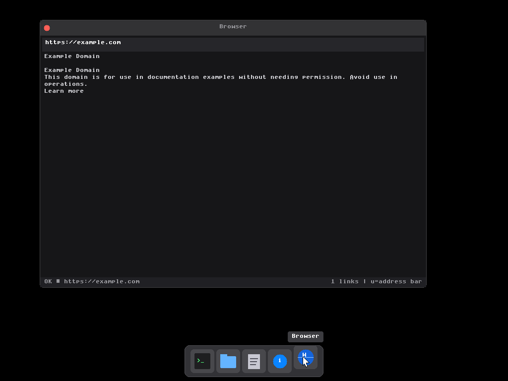

<p align="center">
  
</p>

<h1 align="center">CottonOS</h1>

<p align="center">
  A hobby operating system written in Rust. It boots on x86_64, has its own
  filesystem, a graphical desktop, a TCP/IP network stack, and a small web
  browser that can load real websites over HTTP and HTTPS.
</p>

<p align="center">
  by <a href="https://github.com/aryansrao">aryansrao</a>
</p>

---

I started this project to learn how operating systems actually work, and it
grew from "print text to VGA" into something that can open my own website over
TLS from inside a window manager I wrote myself. Everything in the kernel is
Rust except the boot stub, which is a small piece of NASM that gets the CPU
into long mode and jumps into `_start64`.

It is not a serious OS. Plenty of things are missing or half-finished (see the
honest limitations section below). But it boots, it browses, and it's been a
great way to learn.

<p align="center">
  
</p>

## What it can do

- Boot via GRUB (Multiboot2) into a 64-bit kernel
- Framebuffer desktop with draggable windows: terminal, file manager, text
  editor, system info, and a browser
- Web browsing over HTTP *and* HTTPS. TLS 1.3 runs in-kernel via
  `embedded-tls`; DNS, DHCP, TCP, UDP and ICMP are handled by
  [smoltcp](https://github.com/smoltcp-rs/smoltcp) on top of my RTL8139 driver
- Persistent storage with a custom filesystem (CottonFS) on an ATA disk —
  files you create survive reboots
- Preemptive round-robin scheduler ticking at 1000Hz, with a cooperative side
  task so the GUI keeps rendering while a page is downloading
- PS/2 keyboard and mouse (scroll wheel included), serial debug output
- An interactive shell with filesystem, network and system commands

## The stack, briefly

```
 apps        browser · terminal · files · editor · sysinfo
 gui         window manager, back-buffered framebuffer drawing
 net         smoltcp (TCP/UDP/DNS/DHCP/ICMP) + embedded-tls for HTTPS
 fs          VFS -> CottonFS (persistent, on ATA) + DevFS
 proc        scheduler, processes, threads, sync primitives
 mm          bitmap frame allocator · 4-level paging · linked-list heap
 arch        GDT · IDT · PIC · PIT · port I/O · serial
 boot        GRUB multiboot2 -> boot_stub.asm -> _start64
```

The networking story deserves a note. The first version was a hand-rolled TCP
stack, and it behaved like one: no retransmission, no reordering, and it fell
over after a couple of requests. It got replaced with smoltcp, which is a
proper TCP/IP implementation in Rust designed for exactly this kind of
bare-metal use. The RTL8139 driver now just implements smoltcp's `Device`
trait and hands frames up. If you're building your own OS and are tempted to
write TCP yourself: do it once for the experience, then use smoltcp.

The bug that took the longest to find wasn't in the network code at all. The
kernel heap lives in an identity-mapped region, but the physical frame
allocator didn't know that, so it happily handed out heap memory as DMA
buffers for the NIC. The GUI's back buffer ended up on top of the receive
ring — every frame the desktop was painted, the background color overwrote
incoming packets. If your driver receives garbage and the "garbage" looks
suspiciously like the same 4 bytes repeating, go check whether it's your
wallpaper.

## Building

You need a nightly Rust toolchain, NASM, QEMU, a cross linker and GRUB tools.

macOS:

```bash
brew install qemu nasm xorriso x86_64-elf-binutils i686-elf-grub
```

Ubuntu/Debian:

```bash
sudo apt install qemu-system-x86 nasm grub-pc-bin xorriso mtools binutils
```

Rust side (the repo has a `rust-toolchain.toml`, so rustup handles most of it):

```bash
rustup component add rust-src llvm-tools-preview
```

Then:

```bash
make iso    # build kernel + bootable ISO
make run    # boot it in QEMU with serial output
```

Other useful targets: `make kernel` (just the kernel), `make debug` (GDB
server on :1234), `make clean`.

## Using it

The desktop opens on boot. The dock at the bottom has five apps; the globe
icon is the browser. Type a URL (or just a search term — it goes to wiby.me,
a search engine for the old-school web) and hit Enter. `u` refocuses the
address bar, arrow keys and PgUp/PgDn scroll.

Sites that work well are text-heavy ones: `example.com`, `info.cern.ch`,
`wiby.me`, personal blogs. There is no CSS or JavaScript, so anything modern
renders as readable plain text with the links listed.

The terminal has the usual suspects:

```text
ls · cd · cat · mkdir · touch · rm · write     # CottonFS
net · ping · dhcp · dns · netstats             # network
httpget example.com / · httpsget example.com / # fetch without the GUI
mem · df · ps · uptime · info                  # system
```

QEMU is configured with user-mode networking and an emulated RTL8139
(`-nic user,model=rtl8139`), so the guest gets 10.0.2.15 with a gateway and
DNS provided by QEMU — no host setup needed.

## Memory layout

| Region        | Address              | Notes                                   |
|---------------|----------------------|-----------------------------------------|
| Low memory    | 0 – 1MB              | BIOS, VGA, reserved                     |
| Kernel image  | 1MB – 8MB (reserved) | loaded at 1MB by GRUB                   |
| Kernel heap   | 32MB – 64MB          | identity mapped, reserved from the frame allocator |
| DMA buffers   | from 8MB             | NIC rings, allocated by the frame allocator |
| Framebuffer   | wherever GRUB says   | usually high MMIO                       |

## Honest limitations

- No certificate validation on HTTPS. The TLS transport is real encryption,
  but the browser trusts any server. Don't type passwords into it.
- One TCP connection at a time. Fine for the browser, not for much else.
- The browser renders text and collects links; no CSS, no JS, no images.
- Userspace is still a stub — everything currently runs in ring 0.
- The scheduler preempts, but the GUI and network cooperate on one core.
- x86_64 + QEMU is the tested target. Real hardware may or may not boot.

## Project layout

```
kernel/src/
  arch/x86_64/     GDT, IDT, paging, PIT, serial, port I/O
  mm/              physical frame allocator, paging, heap
  proc/            scheduler, processes, threads
  fs/              VFS, CottonFS, DevFS
  drivers/         graphics, keyboard, mouse, ATA, network (RTL8139 + smoltcp)
  crypto/          TLS client on top of the TCP stack
  gui/             window manager, desktop, all the apps
  browser.rs       URL handling, HTTP fetch, HTML-to-text rendering
  task.rs          cooperative net task (keeps the GUI alive during fetches)
  shell.rs         the command interpreter
kernel/boot_stub.asm   multiboot2 header, long-mode setup
linker/                linker scripts
Makefile               build + QEMU targets
```

## Dependencies

| Crate                   | Why                                    |
|-------------------------|----------------------------------------|
| `smoltcp`               | TCP/IP stack (TCP, UDP, DNS, DHCP, ICMP) |
| `embedded-tls`          | TLS 1.3 client                         |
| `linked_list_allocator` | kernel heap                            |
| `spin`, `lazy_static`   | locking and statics without std        |
| `embedded-io`, `rand_core`, `bitflags`, `volatile` | glue |

Everything else — filesystem, drivers, GUI, scheduler — is written from
scratch in this repo.
